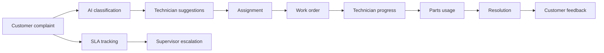
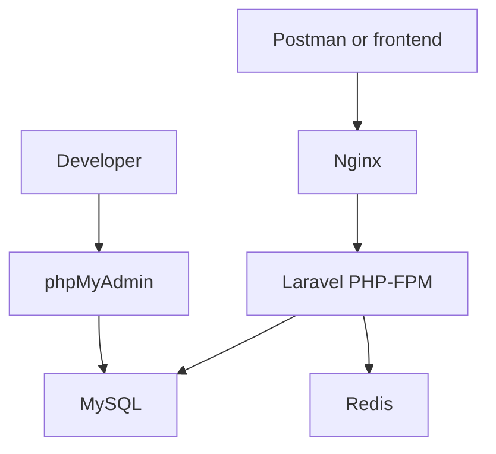

# NimbusOps Architecture

## Style

NimbusOps is an API-first modular monolith. A single Laravel deployment and database keep operations simple, while modules separate business capabilities and can later be extracted if scale requires it.

## Layers

1. **Routes and middleware** authenticate requests and enforce broad role access.
2. **Form Requests** validate payloads and perform contextual authorization.
3. **Controllers** translate HTTP requests into service calls.
4. **Policies** enforce object ownership for complaints and work orders.
5. **Services** implement workflows, transactions, scoring, SLA logic, inventory, and reports.
6. **Models** define persistence and domain relationships.
7. **Timeline and audit records** preserve operational and security history.

## Modules

| Module | Responsibility |
|---|---|
| Auth | Registration, login, logout, current user |
| Customer | Customer profiles and service addresses |
| ServiceArea | Cities, zones, and operational areas |
| Technician | Skills, availability, workload, performance |
| Complaint | Complaint lifecycle, policies, timeline |
| AIClassification | Provider contract, mock classifier, persistence |
| Dispatch | Technician ranking and assignment |
| WorkOrder | Technician job workflow and progress |
| SLA | Deadlines, scheduled breach detection, escalation |
| Inventory | Parts, movements, usage, low-stock detection |
| Feedback | Ratings and technician score calculation |
| Notification | Database event notifications |
| Reporting | Dashboard and aggregate reports |
| Audit | Immutable sensitive-action history |

## Main Workflow

## Replaceable AI Provider

`AIClassificationProvider` is bound to `MockAIProvider` in the service container. Controllers depend on `AIClassificationService`, not a concrete provider. A production provider can replace the binding without changing routes or workflow code.

## Consistency and Concurrency

Assignment, work-order transitions, stock usage, feedback, and SLA breach updates use database transactions. Assignment and stock services use row locks to prevent duplicate assignment and negative inventory during concurrent requests.

## Authorization

- Sanctum authenticates API tokens.
- `RoleMiddleware` protects role-level operations.
- `ComplaintPolicy` isolates customer complaints.
- `WorkOrderPolicy` isolates technician assignments.
- Form Requests enforce context-specific permissions.

## Infrastructure

Docker Compose provides Nginx, PHP-FPM, MySQL, Redis, and phpMyAdmin. GitHub Actions runs Composer validation, Pint, and PHPUnit.

