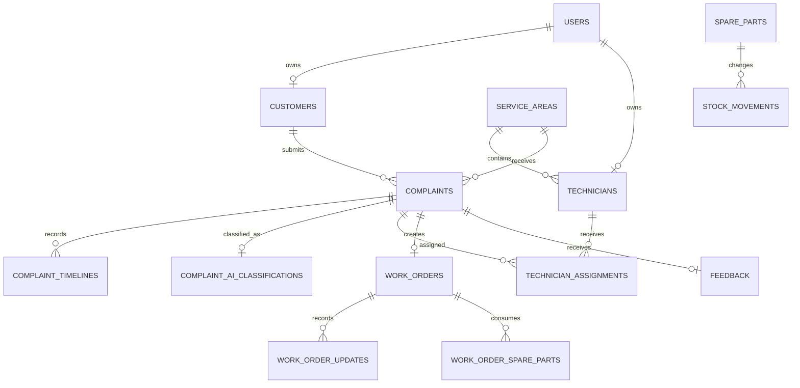

# NimbusOps Database Schema

## Identity and Access

| Table | Purpose |
|---|---|
| users | Identity, password, role, active status |
| personal_access_tokens | Sanctum API tokens |
| password_reset_tokens | Password reset support |
| sessions | Database sessions |

## Customer and Operations

| Table | Key relationships |
|---|---|
| customers | Belongs to user |
| service_areas | Has many technicians and complaints |
| technicians | Belongs to user and optional service area |
| complaints | Belongs to customer, area, and creator |
| complaint_timelines | Belongs to complaint and optional user |
| complaint_ai_classifications | One per complaint |

## Dispatch and Work

| Table | Key relationships |
|---|---|
| technician_assignments | Complaint, technician, assigning user |
| work_orders | Complaint, assignment, technician |
| work_order_updates | Work order and optional user |

## SLA

| Table | Purpose |
|---|---|
| sla_policies | Priority-to-resolution-minute rules |
| complaints SLA columns | Due, breached, and escalated timestamps |

Default policies: critical 120, high 240, medium 720, low 1440 minutes.

## Inventory

| Table | Key relationships |
|---|---|
| spare_parts | SKU, quantity, reorder level, unit cost |
| stock_movements | Part, work order, user, before/after quantity |
| work_order_spare_parts | Work order, part, technician, quantity and cost |

Stock movements preserve an auditable before/after history. Work-order usage stores the cost at time of consumption.

## Experience and Governance

| Table | Purpose |
|---|---|
| feedback | One rating per complaint/work order |
| notifications | Laravel database notifications |
| audit_logs | Actor, action, entity, IP, user agent, metadata |

## Important Constraints

- User email and spare-part SKU are unique.
- One customer and technician profile per user.
- One AI classification and work order per complaint.
- One feedback record per complaint and work order.
- Foreign keys protect workflow consistency.
- Restrictive deletes preserve inventory and technician history.
- Composite indexes support status, priority, SLA, and reporting queries.

## Relationship Summary

